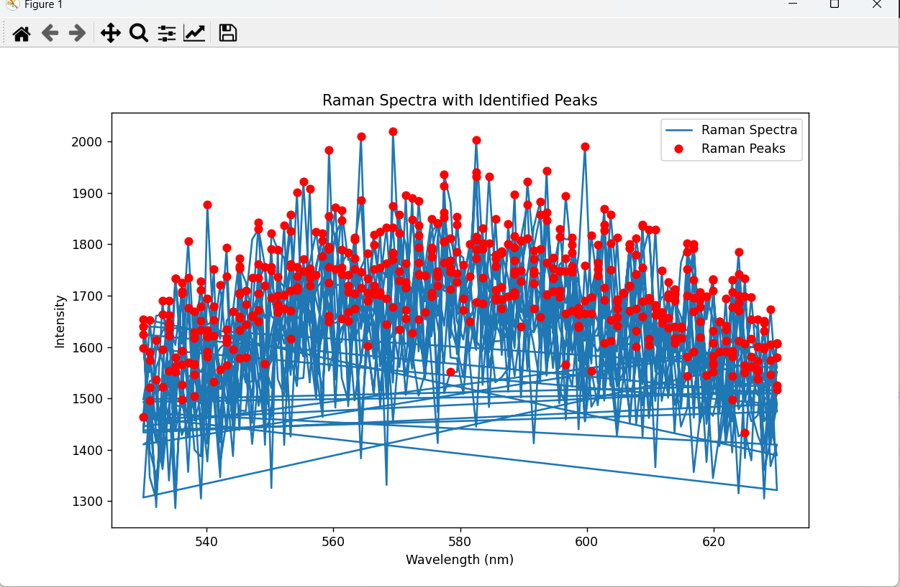

# Five Steps for Successful Utilization (To-Do List)

* [ ] **Obtain the pre-generated extensions.txt/ requirements.txt generated via the ShareYourProject_Tool_{...} ... or just use the ones i provide.** 

**📁 I reccomend creating your project structure via the good old fashion copy and pasting technique.📁**

│

├──VisualStudioSetup

**│   └──extensions.txt**

**│   └──requirements.txt**

---

* [ ] **Ensure Project Directory Structure Is Correct / Adjust it📁**

**📁 I reccomend creating your project structure via the good old fashion copy and pasting technique.📁**

/your-python-project-directory

│

├──VisualStudioSetup

**│   └──extensions.txt**

**│   └──requirements.txt**

├──ShareYourProject_Tool....{..}

│   └──generate_extensions.py

│   └──generate_pipInstallRequriments.py

├──UseThisProject....{..}

│   └──ReadMe.md

**└──Step1_RunMeFirst.py**

**└──Step2_RunMeSecond.py**

**└──Step3_RunMeFinally.py**

**Note: Move the Bolded Ones. You should have obtained the .txt files in To-dolist task one of this readme.*

---

* [ ] ****Run**: generate_extensions.py🚀**

```
py -m Step1_RunMeFirst.py
```

**Output**: 📁 │  `<Should Succesffully add the extensions to your VSCODE> `

---

* [ ] **Run: generate_pipInstallRequriments.py🚀**

```
py -m generate_pipInstallRequriments.py
```

**Output**: 📁 │  `<Should Succesffully install the python packages to your system.... i recommend a special (env) enviornment if you already use python?, but it is no 100% guarenteed to work otherwise (due to configuration issues.)`

* ** Step3_RunMeFinally.py**🚀****

This will create simulated spectrometer data and then develop a analysis for an example output figure of:

```
py -m Step3_RunMeFinally.py
```

**Example Output:**



## Boom your done... :-). We have simulated obtaining peaks for spectroscopic data.
